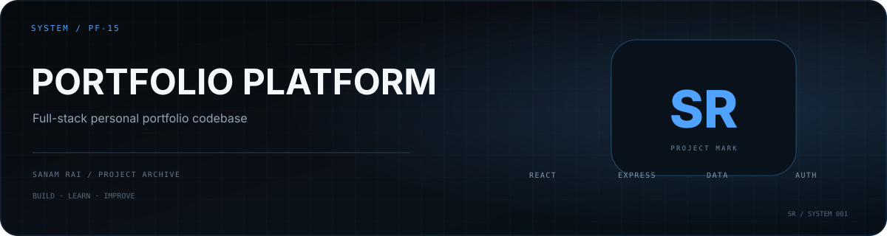

<p align="center">
  
</p>

# Sanam Rai — Portfolio Platform

A backend-focused full-stack portfolio built as an **interactive software system**, not only a static showcase.

The site combines a real Express/MongoDB backend lab with a motion-driven React experience: an interactive Three.js system core, scroll-based architecture storytelling, an editorial project showcase, and **Forge**, a small contextual companion that reacts to meaningful system events.

**Live:** https://sanam-rai.com.np

---

## What makes this portfolio different

### Live Backend Lab
The portfolio exposes runtime configuration for backend capabilities through the interface.

The frontend reads and updates the same system configuration used by the backend, including:

- authentication
- database access
- caching
- request logging
- pagination
- rate-limit configuration

The lab is designed to make backend architecture visible rather than presenting a fake dashboard.

> Rate limiting is currently represented as configuration state only; its middleware is not attached to the project route.

### Interactive System Core
A lightweight Three.js visualization represents:

```text
             AUTH
              ●
              │
CACHE ● ── API CORE ── ● DATABASE
              │
           RUNTIME
              ●
```

The core responds to architecture-story progress and real Backend Lab state while staying performance-conscious:

- capped device pixel ratio
- reduced geometry on compact/coarse-pointer devices
- rendering pauses off-screen
- rendering pauses in hidden browser tabs
- static fallback for reduced motion or unavailable WebGL
- explicit geometry/material/renderer cleanup

### Architecture Story
GSAP + ScrollTrigger turn the system into a readable engineering narrative:

```text
API CORE → AUTH → CACHE → DATABASE → RUNTIME
```

Native scrolling is preserved; there is no scroll hijacking.

### Forge
Forge is a small living companion built from an authored sprite sheet.

It can:

- follow the pointer while keeping distance
- idle and look around
- leave subtle movement sparks
- react to project changes
- react to backend configuration apply/success/failure
- simplify itself for mobile and reduced-motion users

Forge is intentionally contextual rather than a chat popup or UI obstruction.

### Editorial Project Storytelling
Selected work is presented as engineering case studies instead of a standard three-card grid.

The current featured projects include:

- **Krishi Bazar** — marketplace flows, JWT auth, cart state, dual checkout, persistence
- **Backend-Controlled Portfolio** — runtime configuration and API-system behavior
- **YakTalk** — authenticated Socket.IO connections, presence, and private realtime messaging

A separate **Core Projects** section remains API-driven to demonstrate the live backend data path.

---

## Architecture

```text
Browser
   │
   ▼
React + Vite
   │
   │ Axios / JWT
   ▼
Express API
   │
   ├── system configuration
   ├── authentication middleware
   ├── cache layer
   ├── request logging
   └── project controller
          │
          ▼
       MongoDB
```

The frontend and backend are intentionally separate applications inside one repository.

---

## Tech stack

### Frontend

- React 19
- Vite 7
- GSAP 3 + ScrollTrigger
- Three.js
- Tailwind CSS 4
- Axios
- Lucide React
- React Icons

### Backend

- Node.js
- Express 5
- MongoDB
- Mongoose
- JSON Web Tokens
- Node Cache
- Morgan / Winston
- Express Rate Limit

---

## Repository structure

```text
Portofolio/
├── frontend/
│   ├── public/
│   │   ├── forge/
│   │   └── projects/
│   └── src/
│       ├── motion/
│       ├── reusable/
│       ├── ArchitectureStory.jsx
│       ├── LivingForge.jsx
│       ├── ProjectStory.jsx
│       ├── SystemCore.jsx
│       └── SystemControl.jsx
├── backend/
│   ├── config/
│   ├── controllers/
│   ├── middleware/
│   ├── models/
│   ├── routes/
│   └── server.js
├── docs/
│   └── PROJECT_STATE.md
└── assets/
    └── readme/
```

---

## Run locally

### 1. Clone

```bash
git clone https://github.com/SanamRai001/Portofolio.git
cd Portofolio
```

### 2. Backend

```bash
cd backend
npm install
```

Create a backend `.env` with:

```env
DB_URI=your_mongodb_connection_string
JWT_SECRETKEY=your_jwt_secret
PORT=5000
```

Run the backend:

```bash
npm run dev
```

The backend package currently does not define a dedicated `start` or `dev` script.

### 3. Frontend

In another terminal:

```bash
cd frontend
npm install
```

Create a frontend `.env`:

```env
VITE_API_URL=http://localhost:5000
```

Then run:

```bash
npm run dev
```

> The current backend CORS configuration allows the production portfolio domains only. Add your local Vite origin during local full-stack development if needed.

---

## Accessibility and performance

The immersive layer is designed to degrade gracefully:

- `prefers-reduced-motion` support
- keyboard skip navigation
- focus isolation for the authentication modal
- mobile-specific linear layouts
- no scroll hijacking
- WebGL pause while hidden/off-screen
- lazy-loaded below-fold project imagery
- request cancellation for stale project fetches
- live-log polling pauses while the document is hidden

---

## Backend Lab scope

This repository is a portfolio and architecture demonstration.

The lab intentionally exposes implementation ideas so they can be observed from the interface. It should not be treated as a drop-in production authentication/security reference without additional hardening and testing.

Current known engineering debt is tracked in:

`docs/PROJECT_STATE.md`

---

## Development status

The immersive redesign is feature-complete.

Future work is expected to focus on:

- verified regressions
- project/content updates
- backend hardening
- tests
- explicitly approved cleanup

---

## Author

**Sanam Rai**  
Backend · Systems · Full Stack · AI

- Portfolio: https://sanam-rai.com.np
- GitHub: https://github.com/SanamRai001
- LinkedIn: https://www.linkedin.com/in/sanam-rai-6b2149212/


### Backend security checks

From `backend/`:

```bash
npm test
```

The backend test suite includes password hashing/migration and JWT middleware checks. A focused auth-only command is also available:

```bash
npm run test:auth
```


### Legacy password migration

The authentication hardening keeps a temporary compatibility path for pre-existing plaintext user records. Before removing that compatibility, inspect the live database from the backend environment:

```bash
npm run migrate:passwords
```

This is a dry run and does not modify data. If the reported legacy count is expected, apply the migration explicitly:

```bash
npm run migrate:passwords:apply
```

The migration never prints passwords. Each write is conditional on the stored password still matching the value that was scanned, so concurrent changes are not overwritten.
