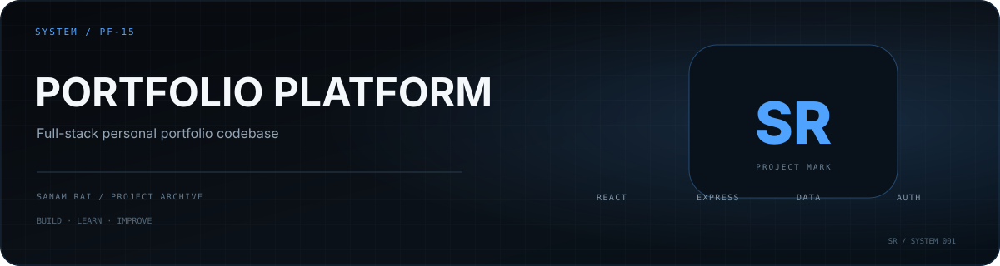

<p align="center">
  
</p>

# Sanam Rai — Portfolio Platform

A backend-focused full-stack portfolio built as an **interactive software system**, not only a static showcase.

The `/` homepage presents backend engineering, a live Express/MongoDB lab, a readable request lifecycle, and project case studies. The separate `/galaxy` route is an interactive Three.js information architecture: realistic planetary worlds are also navigable portfolio destinations for identity, capabilities, projects, progression, and research. Each stable world is URL-addressable under `/galaxy/<world>`, and the homepage still does not load Three.js.

**Live:** https://sanam-rai.com.np

---

## What makes this portfolio different

### Live Backend Lab
The portfolio exposes runtime configuration for backend capabilities through the interface.

The frontend reads and updates the same system configuration used by the backend, including:

- authentication
- database access
- caching
- request logging
- pagination
- rate-limit configuration

The lab is designed to make backend architecture visible rather than presenting a fake dashboard.

> Rate limiting is currently represented as configuration state only; its middleware is not attached to the project route.

### Readable architecture and runtime state
The homepage uses semantic HTML/CSS for the request pipeline and the Backend Lab's live configuration map. There is no WebGL canvas, pinned scrolling, GSAP timeline, or cursor-following mascot on `/`. One shared IntersectionObserver adds a 460ms fade with 16px movement; content is visible by default and reduced motion disables the effect.

### Galaxy — interactive solar-system portfolio
`/galaxy` is a separately loaded Three.js route built around one authoritative scene clock, one planetary world-position model, and semantic world destinations:

- **Core / Sun** — the concise portfolio identity anchor around a continuum-inspired photosphere and restrained corona
- **Identity / Earth** — NASA-derived day/night/cloud/water/terrain rendering plus a working model built around three engineering principles, the Learn → Build → Break → Understand → Fix → Repeat loop, and forward directions
- **Skills / Mercury** — realistic airless regolith with ten proven technology signals organized into three capability rings: Runtime & APIs, Data & Persistence, and System Delivery
- **Projects / Mars** — photographic Mars rendering plus six curated personal-project signals and accessible project detail
- **Journey / Saturn** — structured translucent physical rings plus a separate fixed progression trajectory for BIT, QA, backend direction, MIH Group production experience, and current research exploration
- **The Lab** — a distant research console for StateScout, Reality Archive, ScanSketch, and the Pocket TTS fork; experiment selection retunes the existing Lab scanner instead of adding decorative moons
- **Black Hole** — direct selection automatically enters the existing cancellable approach → plunge → blackout portal handoff

Stable destinations are deep-linkable at `/galaxy/core`, `/galaxy/identity`, `/galaxy/skills`, `/galaxy/projects`, `/galaxy/journey`, and `/galaxy/lab`. Browser Back/Forward and Escape/System return replay the same semantic navigation state.

The four primary planets rotate on their own axes and revolve around Core. Overview orbit tracks remain visible and are derived from the same `orbitPosition()` function as the simulation; focused views fade only world-scale tracks so portfolio copy stays readable. The visible duplicate system-map/preference controls were removed: the worlds themselves are the primary interaction surface, with keyboard navigation retained. OS reduced-motion, hidden/off-screen throttling, low-power rendering, touch interaction, and static no-WebGL fallback remain supported.

Galaxy also has an original five-layer procedural Web Audio soundscape. It creates no AudioContext on initial load, starts only after a real user gesture, retunes by destination, descends through the Black Hole transition, and exposes one compact mute control.

Planetary rendering is reference-informed rather than a claim of physical astronomical simulation. Image provenance is documented in `docs/GALAXY_EARTH_IMAGERY.md` and `docs/GALAXY_TEXTURE_CREDITS.md` while exact motion behavior is documented in `docs/GALAXY_MOTION_AUDIT.md`.

### Editorial Project Storytelling
Selected work is presented as engineering case studies instead of a standard three-card grid.

The current featured projects include:

- **Krishi Bazar** — marketplace flows, JWT auth, cart state, dual checkout, persistence
- **Backend-Controlled Portfolio** — runtime configuration and API-system behavior
- **YakTalk** — authenticated Socket.IO connections, presence, and private realtime messaging

A separate **Core Projects** section remains API-driven to demonstrate the live backend data path.

---

## Architecture

```text
Browser
   │
   ▼
React + Vite
   │
   │ Axios / JWT
   ▼
Express API
   │
   ├── system configuration
   ├── authentication middleware
   ├── cache layer
   ├── request logging
   └── project controller
          │
          ▼
       MongoDB
```

The frontend and backend are intentionally separate applications inside one repository.

---

## Tech stack

### Frontend

- React 19
- Vite 7
- CSS + IntersectionObserver (homepage)
- Three.js (Galaxy only)
- Tailwind CSS 4
- Axios
- Lucide React
- React Icons

### Backend

- Node.js
- Express 5
- MongoDB
- Mongoose
- JSON Web Tokens
- Node Cache
- Morgan / Winston
- Express Rate Limit

---

## Repository structure

```text
Portofolio/
├── frontend/
│   ├── public/
│   │   ├── forge/
│   │   ├── galaxy/photoreal/
│   │   └── projects/
│   └── src/
│       ├── motion/
│       ├── pages/Galaxy/
│       ├── reusable/
│       ├── ArchitectureStory.jsx
│       ├── LivingForge.jsx
│       ├── ProjectStory.jsx
│       ├── SystemCore.jsx
│       └── SystemControl.jsx
├── backend/
│   ├── config/
│   ├── controllers/
│   ├── middleware/
│   ├── models/
│   ├── routes/
│   └── server.js
├── docs/
│   ├── PROJECT_STATE.md
│   ├── GALAXY_NEXT_PHASES.md
│   ├── GALAXY_MOTION_AUDIT.md
│   └── GALAXY_TEXTURE_CREDITS.md
└── assets/
    └── readme/
```

---

## Run locally

### 1. Clone

```bash
git clone https://github.com/SanamRai001/Portofolio.git
cd Portofolio
```

### 2. Backend

```bash
cd backend
npm install
```

Create a backend `.env` with:

```env
DB_URI=your_mongodb_connection_string
JWT_SECRETKEY=your_jwt_secret
PORT=5000
```

Run the backend:

```bash
npm run dev
```

Use `npm start` to run the backend without the development watcher.

### 3. Frontend

In another terminal:

```bash
cd frontend
npm install
```

Create a frontend `.env`:

```env
VITE_API_URL=http://localhost:5000
```

Then run:

```bash
npm run dev
```

> The current backend CORS configuration allows the production portfolio domains only. Add your local Vite origin during local full-stack development if needed.

---

## Accessibility and performance

The immersive layer is designed to degrade gracefully:

- `prefers-reduced-motion` support
- keyboard skip navigation
- focus isolation for the authentication modal
- mobile-specific linear layouts
- no scroll hijacking
- WebGL pause while hidden/off-screen
- lazy-loaded below-fold project imagery
- request cancellation for stale project fetches
- live-log polling pauses while the document is hidden

---

## Backend Lab scope

This repository is a portfolio and architecture demonstration.

The lab intentionally exposes implementation ideas so they can be observed from the interface. It should not be treated as a drop-in production authentication/security reference without additional hardening and testing.

Current known engineering debt is tracked in:

`docs/PROJECT_STATE.md`

---

## Development status

The backend-focused homepage and the G3 Galaxy information architecture are deployed from `master`. Galaxy releases are gated by unit/integration checks, lint/build, desktop/laptop/phone browser captures, direct-route/history checks, explicit local image-response verification and Vercel commit status. Physical-device GPU frame-time/touch checks remain separate because headless Chromium cannot prove them. Project-level routes such as `/galaxy/projects/statescout` are intentionally deferred beyond G3 rather than treated as missing release work. See `docs/PROJECT_STATE.md` for the release log, `docs/GALAXY_NEXT_PHASES.md` for the completed-phase/manual-check handoff, and `docs/GALAXY_MOTION_AUDIT.md` for exact rotation/revolution/orbit behavior.

---

## Author

**Sanam Rai**  
Backend · Systems · Full Stack · AI

- Portfolio: https://sanam-rai.com.np
- GitHub: https://github.com/SanamRai001
- LinkedIn: https://www.linkedin.com/in/sanam-rai-6b2149212/


### Backend security checks

From `backend/`:

```bash
npm test
```

The backend test suite includes password hashing/migration and JWT middleware checks. A focused auth-only command is also available:

```bash
npm run test:auth
```


### Legacy password migration

Authentication accepts bcrypt hashes only. To inspect any legacy plaintext records requiring migration, run from the backend environment:

```bash
npm run migrate:passwords
```

This is a dry run and does not modify data. If the reported legacy count is expected, apply the migration explicitly:

```bash
npm run migrate:passwords:apply
```

The migration never prints passwords. Each write is conditional on the stored password still matching the value that was scanned, so concurrent changes are not overwritten.

### Frontend checks

From `frontend/`:

```bash
npm run test:auth-runtime
npm run test:galaxy
npm run test:homepage
npm run lint
npm run build
```

The build checks the emitted module graph to keep Galaxy/Three.js and removed cinematic code out of the homepage imports. DOM tests cover Lab synchronization/rollback, auth isolation, project requests, and reveal lifecycle; they do not replace browser visual verification.
